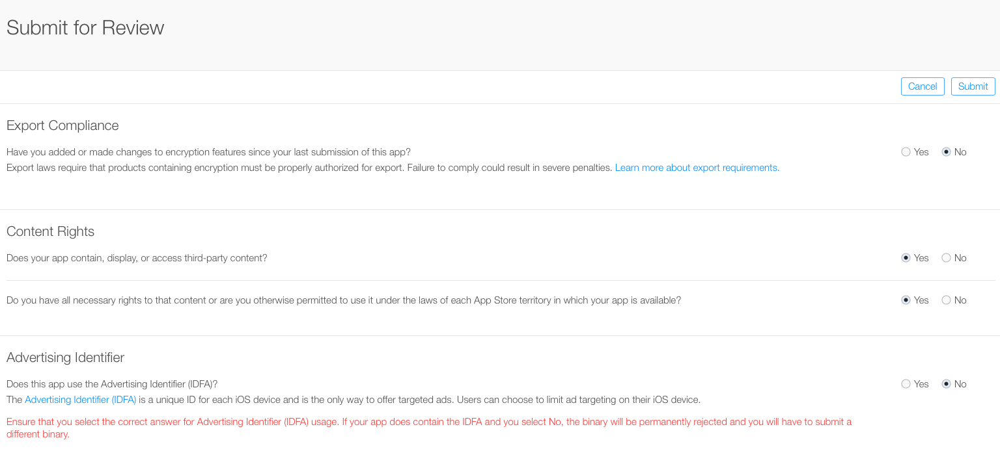
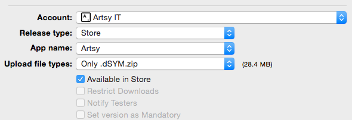

## Deploy to App Store

### TODOs for anyone before deploying

1. Check out eigen Artsy master.
2. Run `make appstore`. This prompts you for a release version number.
3. Update CHANGELOG with the release number.
4. Add and commit the changed files, typically with `-m "Preparing for the next release, version X.Y.Z."`.
5. Make a git tag for the version with `git tag x.y.z`. Push the tags to `artsy/eigen` with `git push --tags`.

### Provisioning Profiles

Open the project in Xcode, click on the Artsy project.

1. Change iOS Deployment Target to "iPhone only" in Info, Deployment Target.
2. Verify that the provisioning profiles under Code Signing are displayed as below in Build Settings.

IMPORTANT: We use the "Artsy Inc Account" not "ARTSY INC" - which is our enterprise account.

The provisioning profile should be _"Artsy Mobile - App Store DistrProfile"_ and when the Code Signing ( which should be automatic ) is clicked it should show  "_iPhone Distribution : Art.sy Inc"_

If you don't see the "Artsy Mobile - App Store DistrProfile" in the options above, import the Dev/Apple/Artsy AppStore Identities from the Artsy Engineering Operations 1Password vault.

If you cannot set Code Signing Identity to "Automatic", under which you'll find "iPhone Distribution: Artsy Inc.", open Xcode Preferences and add it@artsymail.com as an apple account. Also, choose the it@artsymail.com apple ID, click "Artsy Inc." and then refresh until you see two iOS Distribution signing identities, one that says "iOS Distribution (2)".

See [certs.md](certs.md) for more info on certificates.

### Prepare in iTunes Connect
1. You need to have copy for the next release, for minor releases this is just a list of notable changes.
2. Log in to [iTunes Connect](https://itunesconnect.apple.com) as it@artsymail.com ( team _Art.sy Inc_ ).
3. Manage Your Apps > Which-ever app > Add new version. This must be done before you can upload an archive of your new version of the app. (See below.)
4. Fill in the copy for each language (just copy/paste the English copy), change screenshots as necessary, etc. (Or you can do this step at a later point in time.)

### Creating an Archive in Xcode and upload it
1. In Xcode, change the target device to _iOS Device_. 
2. In Xcode, hold alt (`⌥`) and go to the menu, hit _Product_ and then _Archive..._.
3. Check that the Build Configuration is set to _Store_.
4. Hit _Archive_.
5. When archiving is complete, the Archives Organizer view should appear. Select your archive and click _Validate..._ If you haven't yet created a new version of the app in iTunes Connect with the corresponding version number, validation will fail.
6. When prmpted to select a Development Team, select Art.sy Inc. and continue.
7. After validation succeeds, click _Submit..._.

### Connect Archive to iTunes Connect
1. When your archived build upload is done, return to your newly created version in iTunes connect. In the section called _Build_, you should be able to add your newly uploaded Archived build. You can also still make any other changes to copy or images in iTunes Connect at this time.
2. When everything is finalized, hit _Submit Build_. Answer the questions that follow and submit. (See pic.)
3. Your app has now been submitted to the App Store! You can still go back and make copy changes in iTunes Connect if you need to.

### Link with Hockyapp
This step can be done at any time after creating your archived build. The archived build you submit to the App Store must be the same archived build you upload to HockeyApp.

1. Install HockeyApp from http://hockeyapp.net/apps and run it.
2. HockeyApp will automatically see the archive you created.
3. Select the correct archive and click _Open_.
4. On the next screen, make sure that all options are correct. (See pic.)
5. Hit _Upload_ to send your archive to HockeyApp.

### Prepare for the Next Release
1. Run `make next`. This runs `pod install` and prompts for the next version number.
2. Add a new section to CHANGELOG called _Next_.
3. Add and commit the changed files, typically with `-m "Preparing for development, version X.Y.Z."`.
